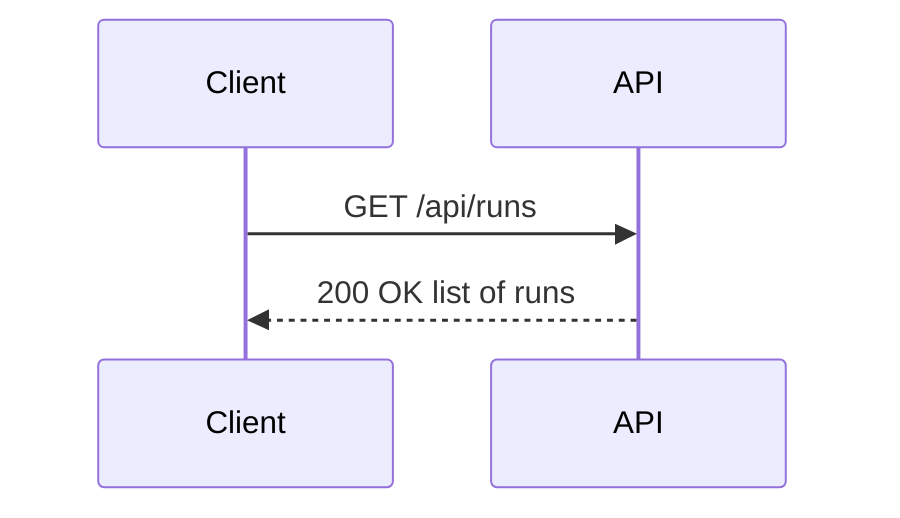
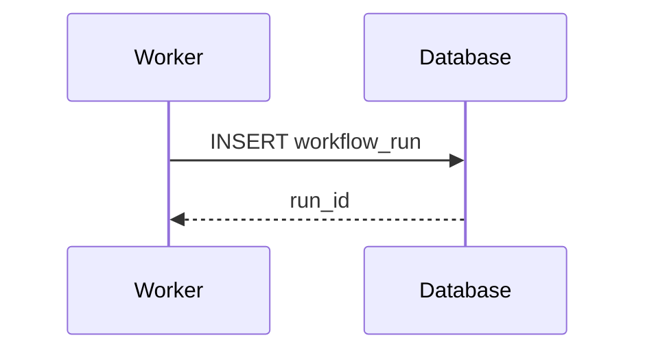

<!-- DO NOT add a # H1 heading here — the title comes from index.json and is rendered by the web UI -->

## Overview

Welcome to ChorusKube — an AI-powered software delivery platform that orchestrates multi-step
development workflows using Temporal, Kubernetes, and large language models. This guide walks
you through running your first automated workflow.

## Prerequisites

Before you begin, make sure you have:

- A running ChorusKube stack (see the project README for the local Docker Compose quick start)
- A supported modern browser (Chrome, Firefox, Edge, or Safari)

ChorusKube's open-source core runs **single-tenant**: there is no login or identity
provider. Opening the web UI drops you straight into the dashboard, scoped to the
built-in workspace.

## Opening the Dashboard

Navigate to the web UI (by default `http://localhost:33000`). There is no sign-in
step — the single-tenant core resolves every request to the built-in workspace, so
you land directly on the dashboard.

## Your First Workflow Run

Follow these steps to kick off your first automated workflow end-to-end.

### Step 1 — Create an Epic, a Story, and a Task

1. Navigate to **Roadmap** in the left sidebar.
2. Click **New Epic**. Enter a title (e.g., "Add user authentication"), a description, an
   optional motivation, and pick the **Git Repository** or **Repository Group** it targets.
   Click **Create**.
3. Open the Epic you just created, click **New Story**, and give it a title and description.
4. Open that Story, click **New Task**, and give it a title and description. Only a Task can be
   started as a workflow run — the Epic and Story around it are organizational containers.

### Step 2 — Start a Workflow Run

1. From the Task's detail view, click **Start**, _or_ navigate to **Runs** and click the **Start**
   button.
2. In the **Start Run** dialog, select a **Workflow Template** (e.g., "Code Review", "Feature
   Implementation") — the target repository comes from the Task's Epic when started from the
   Task detail view.
3. Confirm and click **Start**. The run appears immediately on the **Runs** page with status
   **Running**, and the Task itself moves to `in_progress`.

### Step 3 — Monitor the Run

1. Click the run row to open the **Run Monitor**.
2. The DAG view shows each workflow node (AI agents, human gates, script nodes) with live status:
   - 🟡 **Running** — node is currently executing
   - 🟢 **Completed** — node finished successfully
   - 🔴 **Failed** — node encountered an error
   - ⏸ **Waiting** — paused at a human gate, awaiting your decision
3. Click any node to open its **Log Panel** and view real-time output.

### Step 4 — Handle Approval Requests

If the workflow reaches a **Human Gate** node:

1. A badge appears on **Approvals** in the sidebar.
2. Navigate to **Approvals** and open the pending request.
3. Review the context, attached artifacts, and AI agent output.
4. Click **Approve** or **Reject** — the workflow continues based on your decision.

### Step 5 — Review the Result

Once all nodes complete:

1. Return to the **Runs** page and click the completed run.
2. In the **Run Monitor**, each node shows its final status.
3. If an AI agent opened a Pull Request, the PR link appears in the node detail panel.
4. Browse output artifacts in the **Artifact Browser** tab.

## Navigating the Interface

### Sidebar Sections

| Section | Purpose |
|---|---|
| **Runs** | List all workflow runs; start a new run |
| **Approvals** | Respond to pending human gate requests |
| **Roadmap** | Organize work as Epics, Stories, and Tasks, and start runs from a Task |
| **Analytics** | View run trends and performance metrics |
| **Documentation** | This documentation (you are here) |
| **Settings** | Repositories and preferences |

### Keyboard Shortcuts

| Shortcut | Action |
|---|---|
| `g r` | Go to Runs |
| `g a` | Go to Approvals |
| `g d` | Go to Roadmap |
| `g n` | Go to Analytics |
| `g s` | Go to Settings |
| `Ctrl/Cmd + K` | Open command palette |

## Key Concepts

| Concept | Definition |
|---|---|
| **Workflow Run** | A single execution of a graph template against a target repository |
| **Node** | A unit of work within a run (AI agent, script, human gate, parallel split/join) |
| **Graph Template** | The reusable workflow definition — a directed acyclic graph of nodes and edges |
| **Epic** | The top-level backlog item (title, description, motivation) that targets a Software Project and contains Stories |
| **Story** | A grouping of related Tasks underneath an Epic |
| **Task** | The leaf of the Roadmap hierarchy — the only unit of work that can be started as a workflow run, and the only one with a settable status |
| **Human Gate** | A workflow node that pauses execution and waits for a human approval decision |
| **Agent Node** | A node that spawns an AI agent pod (Claude Code) to perform work autonomously |
| **Repository Group** | A named collection of Git repositories targeted together in a multi-repo run |

## Architecture Overview

The following diagrams show how requests flow through the system.

For further reading, see the [Features Overview](/docs/features) page or visit
the [project repository](https://github.com/dangtrivan15/choruskube).

## Next Steps

Now that you have completed your first run, explore these topics:

- [Workflow Templates](workflow-templates) — learn how to read and design graph templates
- [AI Agent Nodes](ai-agent-nodes) — understand what agent pods do and how to guide them
- [Human Gates](human-gates) — get the most out of approval workflows
- [Multi-Repo Support](multi-repo-support) — run workflows across multiple repositories
- [Best Practices](best-practices) — recommended patterns for production use
