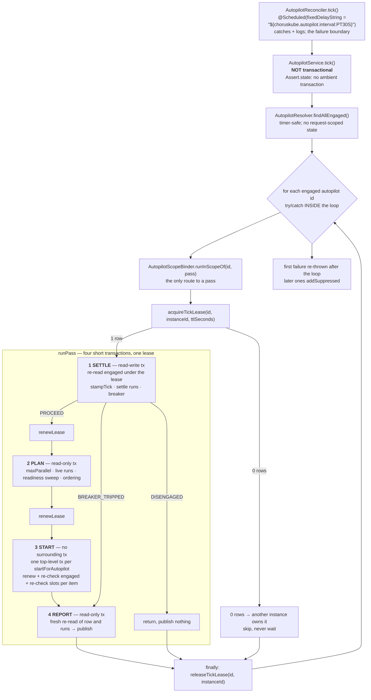
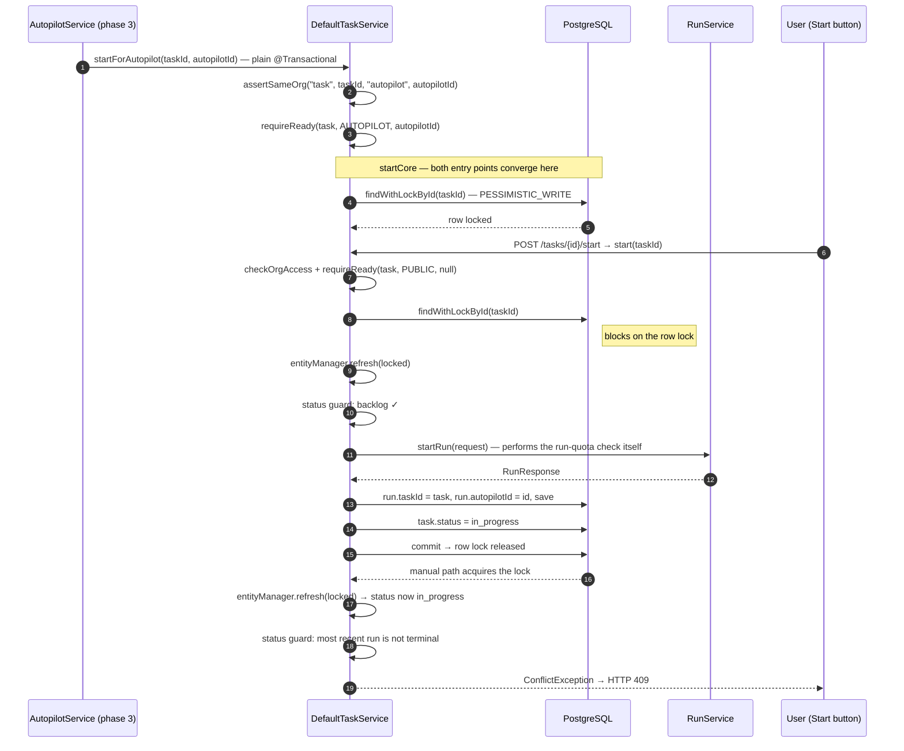
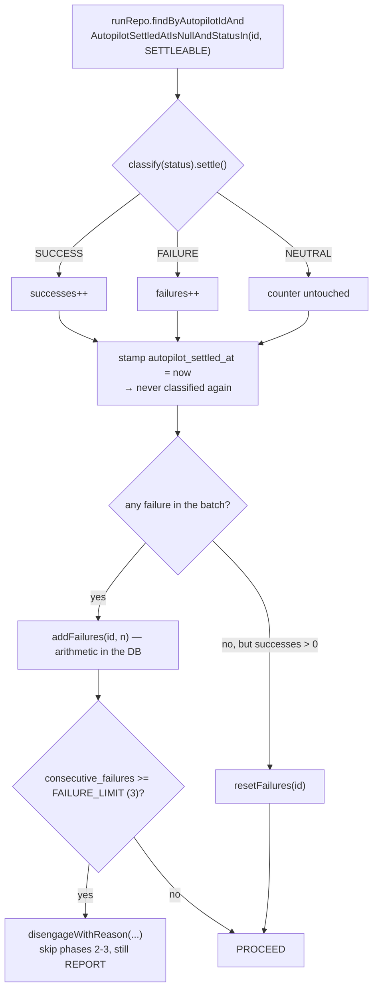

# Autopilot — unattended roadmap dispatch

A contributor-facing description of the standing control loop that starts READY Tasks
without a human clicking Start. For the platform-wide picture see
[ARCHITECTURE.md](../../ARCHITECTURE.md); this document covers only the Autopilot and
assumes you already know what a Task, a run and a graph template are.

## What it is, and what it deliberately is not

The Autopilot is a **controller, not a job**. One long-lived row with an `engaged` flag
and no terminal state: an empty ready frontier means *idle*, not *finished*, so
approving three parked gates repopulates the frontier and the next tick resumes with no
user action.

It removes exactly one step — "pick a READY Task and press Start". It **never** approves
a human gate, resumes a parked run, merges a pull request, or retries a failed run.
Those stay human decisions, permanently. The goal is that human attention is the only
thing the system is ever waiting on.

Two consequences of that framing shape everything below:

- The concurrency ceiling counts **live agent pods only**, because a run parked on a
  human costs nothing to hold. Counting parked runs would make the Autopilot go idle the
  moment you stepped away — the exact problem it exists to remove.
- A failure is never retried. Instead consecutive failures across the loop are counted,
  and at three the Autopilot disengages itself and records why, because the dominant
  causes here (expired token, misconfigured repo, broken agent image) do not clear on
  their own.

## Schema

| Migration | Adds |
|---|---|
| [`V14__autopilot.sql`](../../api-server/src/main/resources/db/migration/V14__autopilot.sql) | `autopilot` table; `workflow_run.autopilot_id` (FK, `ON DELETE SET NULL`) + partial index |
| [`V15__autopilot_settled.sql`](../../api-server/src/main/resources/db/migration/V15__autopilot_settled.sql) | `workflow_run.autopilot_settled_at` + partial index on unsettled rows |
| [`V16__autopilot_tick_lease.sql`](../../api-server/src/main/resources/db/migration/V16__autopilot_tick_lease.sql) | `autopilot.tick_owner`, `autopilot.tick_lease_until` |

`autopilot` columns: `id`, `engaged` (default `false`), `max_parallel` (default `1`,
`CHECK (max_parallel >= 1)`), `consecutive_failures` (default `0`), `disengaged_reason`,
`last_tick_at`, `tick_owner`, `tick_lease_until`, `created_at`, `updated_at`.

Two schema decisions carry weight:

- **The row is not seeded.** No row means "never configured", which `GET` renders as a
  synthetic disengaged payload; the row is INSERTed on the first mutation. This keeps the
  read path read-only and avoids a boot-time seeder, which matters because creation has
  to publish an ownership event that only a request thread can resolve.
- **`workflow_run.autopilot_id` is attribution, not ownership** — `ON DELETE SET NULL`,
  because a run carries external side effects and must never be cascade-deleted by the
  removal of a control-plane row. Losing attribution is the correct degradation.

`autopilot_settled_at` is the failure breaker's idempotence marker; see
[Failure model](#failure-model) for why a timestamp window would not work.

## The tick

[`AutopilotReconciler`](../../api-server/src/main/java/com/choruskube/core/reconciler/AutopilotReconciler.java)
owns the schedule and the failure boundary — nothing else. Every side effect lives in
[`AutopilotService`](../../api-server/src/main/java/com/choruskube/core/service/AutopilotService.java).

| Phase | Method | Transaction | Why that boundary |
|---|---|---|---|
| 1 SETTLE | `settle` | `writes` template (read-write) | The counter must be durable before anything is started |
| 2 PLAN | `plan` | `reads` template, `setReadOnly(true)` | Hibernate switches to MANUAL flush, so a readiness sweep cannot dirty a row on its way past; transactional at all only to avoid borrowing and returning a pooled connection for each of ~2 queries per candidate Epic |
| 3 START | `start` | none of its own; each `startForAutopilot` is its own top-level `@Transactional` | A failed start rolls back only itself, and there is no parent snapshot that predates the runs it commits |
| 4 REPORT | `report` | `reads` template, read-only | Must observe phase 3's commits and any disengage that landed mid-pass |

The phase boundaries are `TransactionTemplate` fields rather than `@Transactional`
private methods. `tick()` calls its phases directly, and a self-invocation never reaches
the Spring proxy — annotating them would produce four *silent* non-transactions and an
accidental return to one long transaction.

`tick()` asserts `!TransactionSynchronizationManager.isActualTransactionActive()` before
doing anything. Both templates are `PROPAGATION_REQUIRED`, so an ambient transaction —
a `@Transactional` added to `tick()`, or any transactional bean calling it — would merge
every phase, every start and the lease's own acquire and release into one long
transaction, with no test failing. Propagation cannot express "there must be no parent",
so the assertion is the enforcement.

### The tick lease

The pass is protected end to end by a lease on the `autopilot` row itself, held in three
conditional single-statement UPDATEs on
[`AutopilotRepository`](../../api-server/src/main/java/com/choruskube/core/repository/AutopilotRepository.java):

| Statement | Guard | 0 rows means |
|---|---|---|
| `acquireTickLease` | `tick_lease_until IS NULL OR tick_lease_until < clock_timestamp()` | someone else is ticking — skip the pass, do not wait |
| `renewTickLease` | `tick_owner = :owner AND tick_lease_until >= clock_timestamp()` | ownership lost — abandon the pass, start nothing further, **not** a failure |
| `releaseTickLease` | `tick_owner = :owner` | the lease already moved on — nothing to release |

Two rules are load-bearing and are asserted by
`AutopilotRepositoryTest#theLeaseStatementsAcceptNoCallerSuppliedClock`:

- **The TTL is passed in seconds, never a timestamp.** If a caller supplied `now` and
  `now + ttl`, one instance's written expiry would be judged against another instance's
  wall clock, and an instance running ahead would steal a live lease.
- **`clock_timestamp()`, not `now()`.** In Postgres `now()` is transaction start time,
  so a statement that ever joined a longer transaction would read a live lease as
  expired.

Whoever loses the race skips the pass rather than queueing behind it: a skipped pass
costs one scheduler interval, a queued one piles instances up behind a slow tick.

## Choosing what to start

### The frontier

A Task is eligible when its Epic is returned by `AutopilotCandidateSource`, its own
status is `backlog`, and its readiness is `READY` — where readiness is computed by
[`EpicReadinessAssembler`](../../api-server/src/main/java/com/choruskube/core/service/EpicReadinessAssembler.java),
the same component the board reads through, including the containment cascade (a Task is
BLOCKED if its own chain, its Story's chain, or its Epic's chain has an unsatisfied
ancestor). One definition of "ready", used by the board, the manual Start button and the
Autopilot alike.

Ordering comes from
[`TaskOrderingStrategy.comparator`](../../api-server/src/main/java/com/choruskube/core/service/TaskOrderingStrategy.java),
in this exact order:

| # | Key | Direction | Note |
|---|---|---|---|
| 1 | Epic priority | descending | `Priority` is declared `low, medium, high`, so every priority comparison is explicitly reversed; a null priority ranks as `medium` |
| 2 | Story priority | descending | |
| 3 | Story target date | ascending, **nulls last** | undated work is not urgent work (`LocalDate.MAX`) |
| 4 | Epic target date | ascending, nulls last | after the Story's: the narrower scope is the more specific signal |
| 5 | Task `created_at` | ascending, nulls last | |
| 6 | Task `id` | ascending | final deterministic tiebreak |

**Epic affinity is deliberately not in the comparator.** It depends on what is currently
in flight, so `AutopilotService.applyEpicAffinity` applies it afterwards as a *stable
partition* of the comparator's output: Tasks whose Epic already has a run occupying a
slot move ahead, relative order preserved inside each group.

Key 6 exists because `maxParallel` defaults to 1: with every prior key tied, which Task
is picked is the entire user-visible behaviour of a tick, so it must be deterministic
across ticks and across replicas rather than left to sort stability.

Explicit priority was chosen over critical-path ordering (prefer the Task that unblocks
the most downstream work) even though critical-path is throughput-optimal, because it
cannot be predicted by looking at the board without mentally computing downstream
fan-out. For something that runs unattended, predictability is worth more than a few
percent of throughput; affinity captures most of the practical benefit anyway.

### `maxParallel` counts live agent pods only

Run status is classified once, in `AutopilotService.classify`, and the query sets
(`OCCUPIES_A_SLOT`, `SETTLEABLE`, `REPORTED_LIVE`) are derived from that classification
rather than written out again — so a query set cannot drift from it.

`WorkflowRunStatusGroups.ACTIVE` is deliberately **not** used here: it includes the
parked statuses, and counting those would reproduce the problem the feature exists to
remove.

`maxParallel` is therefore a budget, not a hard guarantee. Approving ten parked gates at
once fires ten nodes and exceeds the ceiling; honouring it would mean queueing human
decisions, which is worse. Phase 2's `slots` is spent downward only, so **lowering**
`maxParallel` mid-pass takes effect immediately while **raising** it does nothing until
the next tick — acting on a ceiling that is too low costs one scheduler interval, acting
on one that is too high costs agent containers nobody authorised.

### `ReadinessAuthMode`

The Autopilot has to resolve blockers that live in other Epics — that is the case it
exists to work through — and authorising that read needs to know what the caller can be
checked *against*.
[`ReadinessAuthMode`](../../api-server/src/main/java/com/choruskube/core/service/ReadinessAuthMode.java)
names the three worlds:

| Mode | Authorization call | `contextId` | Callers |
|---|---|---|---|
| `PUBLIC` | `checkOrgAccess(type, id)` — request-scoped | `null` | list/graph/timeline read paths, `TaskService.start` |
| `INTERNAL_RUN` | `assertSameOrg(type, id, "workflow_run", contextId)` | the calling run | the `/internal/**` agent paths |
| `AUTOPILOT` | `assertSameOrg(type, id, "autopilot", contextId)` | the Autopilot | `AutopilotService.computeFrontier`, `TaskService.startForAutopilot` |

`AUTOPILOT` exists because the timer thread has neither a request context nor a calling
run: org is derived from the data instead of from a caller's token. Two call sites fail
closed rather than guess, and both are worth preserving:
`EpicReadinessAssembler.resolveExternalBlocker`'s mode switch is a switch *statement*
(which javac does not exhaustiveness-check) so it carries a throwing `default`, and
`DefaultRoadmapGraphService.usesInternalRunListing` rejects `AUTOPILOT` explicitly
rather than letting a `mode == INTERNAL_RUN` boolean silently route a future mode to the
request-scoped listing.

## The start path

Phase 3 calls
[`TaskService.startForAutopilot`](../../api-server/src/main/java/com/choruskube/core/service/TaskService.java),
which shares its body with the manual `start()` through a private `startCore`. The
shared part is what makes the two entry points safe against each other.

Three details are easy to remove by accident:

- **The row lock is on the Task, and it is what resolves the race.** Nothing upstream
  covers it: the tick lease is keyed on `autopilot.id` and serialises pass against pass,
  and the manual path takes no lease at all. Under READ COMMITTED both starters would
  otherwise read `backlog`, both pass the status guard, and both commit — two agent
  containers for one Task.
- **`entityManager.refresh` is not defensive.** The locking finder returns the instance
  *already in the persistence context*, still carrying the status read before the lock
  was granted — precisely the value the winner invalidated while the loser queued. Only
  an explicit refresh re-reads it. (This is the one thing `EntityManager` is injected
  into `DefaultTaskService` for; Spring Data has no `refresh`.)
- **The attribution is stamped on a re-fetch.** `CreateRunRequest` carries neither
  `task_id` nor `autopilot_id`, so both are set on the run after `startRun` returns.
  `autopilotId` is `null` for a manual start, and that null is how the Autopilot tells
  its own in-flight work from a human's.

The resulting `ConflictException` reaches the caller as **409** via
`GlobalExceptionHandler`. When the Autopilot is the loser, phase 3 treats that 409 as
"the roadmap moved under the plan" and continues with the next Task — see below.

## Failure model

### Classification

`AutopilotService.classify(WorkflowRunStatus)` is a switch **expression with no
`default`**, so adding a tenth run status is a compile error here rather than a value
that silently occupies no slot and settles as nothing.

| `WorkflowRunStatus` | Occupies a slot | Settles as | Reported bucket |
|---|---|---|---|
| `pending`, `running` | ✅ | — (not finished) | — |
| `awaiting_human`, `live_chat`, `paused` | ❌ | — (not finished) | `awaitingYou` |
| `awaiting_retry` | ❌ | **FAILURE** | `needsAttention` |
| `completed` | ❌ | SUCCESS | — |
| `failed` | ❌ | **FAILURE** | — |
| `cancelled` | ❌ | NEUTRAL | — |

`cancelled` is neutral because a human cancelling a run is not the Autopilot failing —
and it must not leave stale failure credit behind either, so it settles with no effect on
the counter.

### Settle and the breaker

**Idempotence comes from the marker column, not from a `last_tick_at` window.**
`awaiting_retry` is a durable *status*, not an event, so any unrelated re-save of a dead
run (the pull-request reconciler, a node-execution update) would put it back inside such
a window and count it as a fresh failure — three touches of one dead run would disengage
the Autopilot on their own.

A mixed batch resolves as **any failure wins**: one `completed` alongside one `failed`
must increment rather than reset, or the outcome would depend on the row order the query
happened to return.

The counter is incremented **in the database**
(`SET consecutive_failures = consecutive_failures + :delta`), so two replicas settling
one failed run each produce 2 where a read-increment-write would lose one. `applyBreaker`
therefore re-reads the count rather than carrying it — the number in
`disengaged_reason` is the number in the row.

In phase 3 the accounting is per item and immediate: a failed start calls `addFailures`
in its own short transaction, so a process that dies mid-pass has already recorded what
it learned.

### What is deliberately *not* a failure

| Signal | Handling | Why |
|---|---|---|
| `QuotaExceededException` | end the pass, add a `whyIdle` note, breaker untouched | back-pressure: the work is fine, only the moment is wrong |
| `ConflictException` from a start | skip that Task, continue the pass | the Task is no longer the backlog/READY Task the frontier was swept for — someone clicked Start, or a dependency was added. Three lost races would otherwise disengage for no reason |
| lease loss on renew | abandon the pass silently | this instance simply stopped being the one allowed to do the work |
| `cancelled` run | settles, counter unchanged | a human cancelling is not a platform fault |
| a scope that cannot be bound (throw from the binder) | propagates, skipping `settle` entirely | a platform fault must not spend an installation's failure budget |

`QuotaExceededException` lives in
[`com.choruskube.core.exception`](../../api-server/src/main/java/com/choruskube/core/exception/QuotaExceededException.java)
rather than in whatever enforces quotas, precisely because core callers must be able to
`catch` it to make this distinction — they cannot catch a class they do not have.
`QuotaChecker` implementations outside this repository must throw that class.

### The safety valve — a separate stop

[`AutopilotSafetyValve`](../../api-server/src/main/java/com/choruskube/core/service/AutopilotSafetyValve.java)
is a one-method interface implemented by `AutopilotService` and injected wherever a
component discovers that the world the Autopilot reasons about has gone dark. Today's one
caller is `PullRequestStateService`: if pull-request state can no longer be read, Tasks
stop closing, the dependency graph goes stale, and dispatching more work against a
picture of the roadmap nobody can trust is worse than stopping.

It disengages on the **first** occurrence and deliberately does **not** touch
`consecutive_failures` — mixing an external failure into that counter would let one
credential hiccup plus two unrelated run failures trip the breaker with a reason naming
the wrong cause. It takes the failing resource as a parameter (`resourceType`,
`resourceId`) because every caller is on a timer thread with no request context, and it
resolves the owning Autopilot from that resource. The `engaged = true` guard lives inside
the UPDATE (`disengageIfEngagedWithReason`), so a reconciler that reports the same failure
on every pass overwrites nothing and publishes once.

It is a narrow interface rather than the whole service on purpose: the Autopilot's
dependency graph is one-directional, and a reconciler holding an `AutopilotService` could
call `tick()`, `engage()` or `update()` from a thread that has no business doing any of
them.

## Extension points

The core runs single-tenant; a downstream implementation may supply real multi-tenant
behaviour. Four seams exist for that, each with a core default gated by the same idiom
used by every other OSS seam in this repo — `@ConditionalOnProperty(name = "auth.enabled",
havingValue = "false", matchIfMissing = true)` — so a downstream bean **replaces** the
core one rather than colliding with it.

| Seam | Core default bean | Contract |
|---|---|---|
| [`AutopilotResolver`](../../api-server/src/main/java/com/choruskube/core/service/AutopilotResolver.java) | `SingleTenantAutopilotResolver` | Which row a caller means. `forCurrentScope()` / `getOrCreateForCurrentScope()` may read request-scoped state; `findAllEngaged()` and `forResource()` run on a timer thread and must not |
| [`AutopilotScopeBinder`](../../api-server/src/main/java/com/choruskube/core/service/AutopilotScopeBinder.java) | `SingleTenantAutopilotScopeBinder` | Runs one pass in the scope that owns an Autopilot. Core binds nothing and just runs the pass |
| [`AutopilotCandidateSource`](../../api-server/src/main/java/com/choruskube/core/service/AutopilotCandidateSource.java) | `AllEpicsCandidateSource` | Which Epics the frontier may draw from, keyed on `autopilotId`. Core returns every Epic |
| [`OrgScopedFeedPublisher#autopilotChanged`](../../api-server/src/main/java/com/choruskube/core/event/OrgScopedFeedPublisher.java) | `DefaultOrgScopedFeedPublisher` | Where the status snapshot is published. Core sends it to `/topic/autopilot` |

The shape is always the same: **core declares and invokes the boundary; a downstream
implementation decides what it means.** `tick()` is core code, so core is the only place
that can put a scope around a pass — left downstream, that becomes AOP around a core
method, and the `finally` that must never be missed would exist at every site someone
later adds instead of once in one reviewed place.

### `AutopilotScopeBinder`'s contract

Stated in full in the interface javadoc; summarised here because these are the clauses a
new implementation gets wrong:

1. **Unbind in a `finally`.** One scheduler thread runs every pass in turn, so state left
   bound is picked up by the next pass — one scope's work attributed to another, which is
   the defect class this seam exists to prevent, reintroduced by the fix for it.
2. **Resolve the scope from `autopilotId`,** not from ambient state; on this thread there
   is none, and whatever a thread-local happens to be holding belongs to somebody else.
3. **Do not swallow.** The caller isolates passes from one another and re-throws the first
   failure; both depend on seeing the exception, and a binder that caught it would also
   keep the failure breaker from ever noticing a broken installation.
4. **Restore, do not clear.** A scope is often already bound — `POST /api/v1/autopilot/tick`
   runs `tick()` on a request thread, and the e2e suite drives exactly that endpoint — so
   put the previous value back rather than clearing to empty. This is a routine path, and
   the one a scheduler-only test never reaches.
5. **Run the pass exactly once, on the calling thread, and throw rather than skip.** An
   implementation that resolves the scope optionally and runs the pass only on success
   does nothing at all otherwise: no exception, no failure recorded, nothing logged, and
   an Autopilot that is engaged and permanently idle.

Plus one property about transactions: an implementation **must hold no transaction open
around the pass**. Reading its own state first is fine — resolving which scope owns an
Autopilot is a database read — but that read must not still be inside an open transaction
when the pass runs. A `@Transactional` on the implementation is enough to merge the four
phases and the lease back into one long transaction, and `tick()`'s assertion runs
*before* the binder, so it cannot see one opened there.

`AutopilotService.tick()` reaches a pass **only** through the binder. Because the core
binder is a pass-through and cannot show the difference behaviourally, that is pinned
structurally by `AutopilotServiceTest#tick_reachesThePassOnlyThroughTheScopeBinder`.

### Row creation and the ownership event

`getOrCreateForCurrentScope()` returns `Resolved(UUID id, boolean created)`. An
implementation **reports** the insert and stops there; `AutopilotService.ensureRow()`
publishes `MappableCreated.of("autopilot", id)` off that flag, in the same transaction as
the insert. Publishing is not an obligation on implementations on purpose: an obligation
is something an implementer can forget, and forgetting this one is silent, whereas
reporting `created` untruthfully is loud. This is also why creation lives on the request
path only — `findAllEngaged()` never creates.

`findAllEngaged()` must return **at most one Autopilot per scope**. Two concurrent
first-writes can leave an orphan row, and handing the scheduler both would mean two passes
over one scope, each counting the other's containers as free capacity.

`"autopilot"` is the resource-type string used by the ownership event and by
`assertSameOrg("task", taskId, "autopilot", autopilotId)`; a downstream implementation has
to recognise it.

## API and realtime

[`AutopilotController`](../../api-server/src/main/java/com/choruskube/core/controller/AutopilotController.java)
— every handler carries a **method-level** `@PreAuthorize` (a class-level annotation does
not satisfy the security-annotation completeness test).

| Verb | Path | Guard | Notes |
|---|---|---|---|
| `GET` | `/api/v1/autopilot` | `@orgSecurity.canRead()` | never inserts; a disengaged Autopilot gets no `nextUp` at all, since an ordered list for something that will start nothing is a fiction |
| `PATCH` | `/api/v1/autopilot` | `@orgSecurity.canOperate()` | `maxParallel`; null leaves it unchanged |
| `POST` | `/api/v1/autopilot/engage` | `canOperate()` | also clears `consecutive_failures` and `disengaged_reason` |
| `POST` | `/api/v1/autopilot/disengage` | `canOperate()` | never touches in-flight runs; clears `disengaged_reason`, because a human switching it off is not a fault and the UI renders that field as a fault banner |
| `POST` | `/api/v1/autopilot/tick` | `canOperate()` | runs one tick synchronously — the hook that makes the e2e suite deterministic instead of timing-dependent |

All five return `AutopilotStatusResponse` (`engaged`, `maxParallel`, `inFlight`, `slots`,
`nextUp`, `whyIdle`, `awaitingYou`, `needsAttention`, `consecutiveFailures`,
`disengagedReason`, `lastTickAt`), with `AutopilotTaskRef(taskId, title, runId, status)`
in the three lists. `runId` is null in `nextUp`, and `status` follows it: the Task's own
status where there is no run, the run's status where there is.

`whyIdle` is the trust-critical field. An unattended dispatcher that has stopped for a
structural reason — at capacity, nothing ready, an Epic with no Tasks blocking everything
downstream, a run stuck in `pending` holding a slot — has to read differently from one
that has silently died.

The same payload is published over STOMP to **`/topic/autopilot`** on every engage,
disengage, update, safety-valve stop, and **every tick** (including ticks that started
nothing — `last_tick_at` moved, and an idle Autopilot must not look like a dead one). The
whole status is the payload rather than a bare signal, because a subscriber that responded
to a signal by refetching would race the transaction that produced it. The web UI writes
the payload straight into its query cache and never polls this topic.

## Configuration

| Property | Default | Effect |
|---|---|---|
| `choruskube.autopilot.enabled` | `${AUTOPILOT_ENABLED:true}` | Gates the `AutopilotReconciler` bean. Set to `false` in the test profile (an engaged Autopilot would start real runs during the suite) and in `docker-compose.e2e.yaml` (the e2e suite drives `POST /tick` instead) |
| `choruskube.autopilot.interval` | `${AUTOPILOT_INTERVAL:PT30S}` | `@Scheduled(fixedDelayString = ...)` |
| `choruskube.autopilot.tick-lease-ttl` | `PT5M` | Lease TTL. **Refuses to start below 30s** — see below |
| `choruskube.autopilot.stale-pending-after` | `PT15M` | How long a `pending` run may hold a slot before it is named in `whyIdle`. Surfaced, never reaped: cancelling a run whose workflow may in fact be running is the worse mistake |
| `choruskube.instance-id` | random UUID per process | The lease owner. Configurable so a deployment can make the owner recognisable in the row, and so tests can stand in for a second instance |

Only the first two are declared in `application.properties`; the rest exist as `@Value`
defaults on the `AutopilotService` constructor.

## Things a reader gets wrong from the names alone

**The single-transaction, advisory-lock tick is superseded.** An earlier design had
`tick()` as one `@Transactional` method guarded by `pg_advisory_xact_lock(autopilot.id)`.
That structure was the single root cause of four separate defects (a human's Disengage
reverted by a write-back minutes older than it; the emergency stop queued behind a whole
pass; a tick unable to observe the runs it had just started; a panel reporting a stale
`engaged`). It is gone. `pg_advisory_xact_lock` is transaction-scoped and could not
survive the split — a phase-1 lock releases at phase 1's commit, leaving phases 2–4
unprotected, which is exactly how two instances break `maxParallel`.
`LockService.acquireLock(UUID)` was deleted with it; the surviving
`LockService.acquireOrgRunLock(UUID)` has no core caller and exists only as a seam.

**`startForAutopilot` is not `REQUIRES_NEW`.** It was, while the tick was one long
transaction wrapped around every start. It is now plain `@Transactional`, because the
tick calls it from no transaction at all, one top-level transaction per Task: there is no
parent to poison, and no parent whose snapshot predates the commits. Re-adding
`REQUIRES_NEW` would recreate the nesting that caused both problems, on a second pooled
connection nothing needs.

**`AutopilotRepository` is not a `JpaRepository`, and that is the design.** It extends
plain `Repository<Autopilot, UUID>` and exposes no `save`, no `saveAndFlush`, no `merge`,
so there is no way to write the row by reading it, changing a field and writing it back.
Every write is a single-statement UPDATE that carries `updated_at` explicitly (bulk JPQL
bypasses lifecycle callbacks, which is why `Autopilot` has none — a `@PreUpdate` there
would silently never fire). `flushAutomatically` + `clearAutomatically` on each statement
is what makes "write, then re-read" correct and replaces the `entityManager.refresh` calls
the previous design needed. `AutopilotServiceTest#nothingCanWriteTheAutopilotRowThroughTheEntity`
fails loudly if `extends JpaRepository` comes back. This also makes `@DynamicUpdate` on
the entity a plain optimisation rather than the correctness mechanism it used to be.

**A too-short lease TTL is a silent outage, not a narrower safety margin.** If the lease
is shorter than a pass, it has already expired by the time phase 1 commits: every renewal
fails, every pass abandons after settling, and nothing is ever started again — while phase
1 keeps stamping `last_tick_at`, so the panel reports a healthy tick forever. That is why
the constructor asserts a 30-second floor and refuses to start below it. Thirty seconds is
a floor, not a recommendation; a real pass includes a readiness sweep and several
container starts, and the default is ten times it.

**`paused` is an "awaiting you" status, not a slot holder.** So is `live_chat`.
Conversely `awaiting_retry` is simultaneously a FAILURE for the breaker and a permanent
`needsAttention` entry, because the Autopilot never retries it.

**Phase 4 re-reads everything.** It does not report what phase 2 believed. A disengage
that landed mid-pass has to show as off — at exactly the moment someone is watching to
confirm the stop worked — and the starts committed on their own connections.

## Code map

| File | Role |
|---|---|
| [`AutopilotService.java`](../../api-server/src/main/java/com/choruskube/core/service/AutopilotService.java) | The controller: `tick()` loop, lease, four phases, breaker, frontier, status building |
| [`AutopilotReconciler.java`](../../api-server/src/main/java/com/choruskube/core/reconciler/AutopilotReconciler.java) | Schedule and failure boundary |
| [`AutopilotRepository.java`](../../api-server/src/main/java/com/choruskube/core/repository/AutopilotRepository.java) | Every write as one statement; the three lease statements |
| [`Autopilot.java`](../../api-server/src/main/java/com/choruskube/core/model/Autopilot.java) | The entity — no generator, no lifecycle callbacks |
| [`AutopilotResolver.java`](../../api-server/src/main/java/com/choruskube/core/service/AutopilotResolver.java) | Which row a caller means |
| [`AutopilotScopeBinder.java`](../../api-server/src/main/java/com/choruskube/core/service/AutopilotScopeBinder.java) | Scope boundary around one pass |
| [`AutopilotCandidateSource.java`](../../api-server/src/main/java/com/choruskube/core/service/AutopilotCandidateSource.java) | Which Epics are in scope |
| [`AutopilotSafetyValve.java`](../../api-server/src/main/java/com/choruskube/core/service/AutopilotSafetyValve.java) | External-failure stop |
| [`DefaultTaskService.java`](../../api-server/src/main/java/com/choruskube/core/service/DefaultTaskService.java) | `start` / `startForAutopilot` / `startCore` — row lock, refresh, attribution |
| [`EpicReadinessAssembler.java`](../../api-server/src/main/java/com/choruskube/core/service/EpicReadinessAssembler.java) | One definition of "ready", shared with the board |
| [`TaskOrderingStrategy.java`](../../api-server/src/main/java/com/choruskube/core/service/TaskOrderingStrategy.java) | The frontier comparator |
| [`AutopilotController.java`](../../api-server/src/main/java/com/choruskube/core/controller/AutopilotController.java) | The five endpoints |
| [`AutopilotPage.tsx`](../../web-ui/src/pages/AutopilotPage.tsx) / [`useAutopilot.ts`](../../web-ui/src/hooks/useAutopilot.ts) | The control surface and its live subscription |

## See also

- [ARCHITECTURE.md](../../ARCHITECTURE.md) — the platform overview this sits inside
- [CONTRIBUTING.md](../../CONTRIBUTING.md) — how to build and test changes
